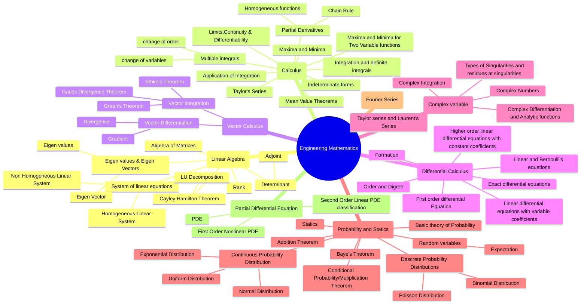

# Engineering Mathematics Documentation 📐📈

Welcome to the Engineering Mathematics Documentation repository! This repository contains comprehensive documentation, notes, and resources related to Engineering Mathematics.[All Q Click here](https://drive.google.com/file/d/1AkxwdOY9h25YsBeI_uTjZ3vyI4_rdjnL/view?usp=drivesdk)

## Table of Contents
-# [Introduction](#introduction)

  - [1. Linear Algebra](https://drive.google.com/file/d/1Atd2nEjgSdHcKWqAQwRw5mc06zpl7uY8/view?usp=drivesdk)
  - [2. Calculus](https://drive.google.com/file/d/1FSp3CBMjMG_uGBgcsGpi9ZkCx5NEmWmz/view?usp=drivesdk)
  - [3. Vector Calculus](https://drive.google.com/file/d/1FRKe7Y3sZnsiGJt7zoHJMB4r9lvyfsnT/view?usp=drivesdk)
  - [4. Differential Equations](https://drive.google.com/file/d/1QOx9hfJ0vdnekRMJjQOp0qWArbm87iCK/view?usp=drivesdk)
  - [5. Complex Variables](https://drive.google.com/file/d/1QHu6uSPnTlrlX38J5Kk-rFkGDt61PwLb/view?usp=drivesdk)
  - [6. Probability and Statistics](https://drive.google.com/file/d/1U24wG6YYpv6DAkCj9wmwuCsiL5FxbKG-/view?usp=drivesdk)
  - [7. Numerical Methods](#7-numerical-methods)
  - [8. Laplace Transforms](#8-laplace-transforms)
  - [9. Fourier Series](#9-fourier-series)
  - [10. Partial Differential Equations](#10-partial-differential-equations)

Each section contains detailed notes, equations, examples, and illustrations to help you understand Engineering Mathematics concepts.

## Introduction 🌟

Engineering Mathematics is a fundamental subject in engineering and science, and this repository aims to provide valuable resources to help you understand and apply mathematical concepts effectively.

## Getting Started 🚀

If you're new to Engineering Mathematics or this repository, here's how you can get started:

1. [Download the PDF](#link-to-pdf): Provide a link to the PDF file containing the Engineering Mathematics documentation.

2. [Installation](#installation): If there are any specific installation instructions for software or tools required for this documentation, provide them here.

3. [Usage](#usage): Instructions on how to effectively use and navigate through the documentation.

## Contributing 🤝

Contributions to this documentation are highly encouraged! If you'd like to contribute:

1. Fork this repository.
2. Create a new branch for your changes: `git checkout -b feature/your-feature`.
3. Make your changes and commit them: `git commit -m 'Add your feature'`.
4. Push your changes to your forked repository: `git push origin feature/your-feature`.
5. Create a pull request from your forked repository to this repository.

Please follow our [Contributing Guidelines](CONTRIBUTING.md) for more details.

## License 📜

This documentation is licensed under the [MIT License](LICENSE). Feel free to use, modify, and distribute it in accordance with the terms of the license.

---

Explore and master Engineering Mathematics with this comprehensive documentation! 📐📈💡
